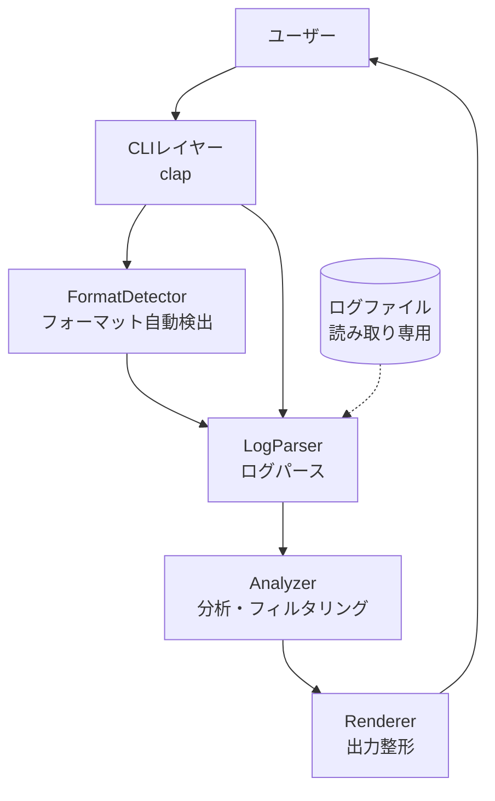
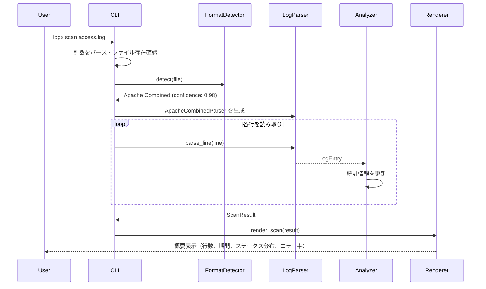
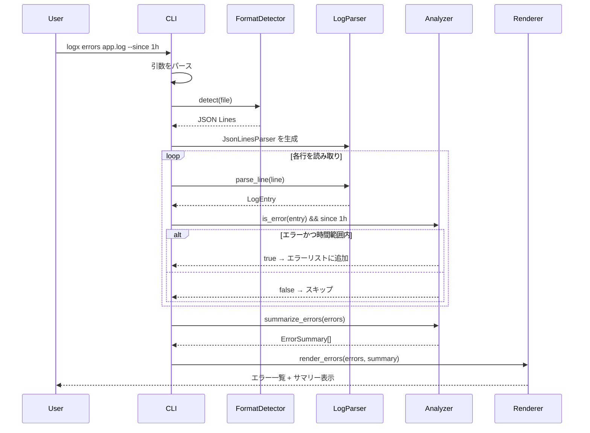

# 機能設計書 (Functional Design Document)

## システム構成図



## 技術スタック

| 分類 | 技術 | 選定理由 |
|------|------|----------|
| 言語 | Rust | 高速処理・単一バイナリ配布・メモリ安全性 |
| CLIフレームワーク | clap | Rustのデファクト。derive マクロで宣言的に定義可能 |
| カラー出力 | termcolor | クロスプラットフォーム対応のターミナルカラー |
| 日時処理 | chrono | タイムスタンプのパース・比較・フォーマット |
| 正規表現 | regex | ログフォーマットのパターンマッチング |
| JSON パース | serde_json | JSON Lines形式のログ解析 |
| IPアドレス | ipnet | CIDR範囲によるIPフィルタリング |

## データモデル定義

### LogFormat（ログフォーマット列挙型）

```rust
enum LogFormat {
    ApacheCombined,   // Apache Combined Log Format
    ApacheCommon,     // Apache Common Log Format
    Nginx,            // Nginx default format
    JsonLines,        // 1行1JSONのログ
    Syslog,           // RFC 3164 / RFC 5424
    PlainText,        // 未知のフォーマット（フォールバック）
}
```

### LogEntry（パース済みログエントリ）

```rust
struct LogEntry {
    raw: String,                    // 元の行テキスト
    timestamp: Option<DateTime>,    // 検出されたタイムスタンプ
    level: Option<LogLevel>,        // ログレベル（ERROR, WARN等）
    status_code: Option<u16>,       // HTTPステータスコード
    method: Option<String>,         // HTTPメソッド（GET, POST等）
    path: Option<String>,           // リクエストパス
    ip: Option<IpAddr>,             // クライアントIPアドレス
    message: Option<String>,        // ログメッセージ本文
    line_number: usize,             // 元ファイルでの行番号
}

enum LogLevel {
    Debug,
    Info,
    Warn,
    Error,
    Fatal,
    Critical,
}
```

**制約**:

- `raw` は元の行をそのまま保持する（表示・デバッグ用）
- `timestamp` がNoneの場合、時間ベースのフィルタリングからは除外される
- `status_code` はHTTPログ以外ではNone

### ScanResult（スキャン結果）

```rust
struct ScanResult {
    file_path: String,
    format: LogFormat,
    total_lines: usize,
    first_timestamp: Option<DateTime>,
    last_timestamp: Option<DateTime>,
    status_distribution: StatusDistribution,
    error_count: usize,
    error_rate: f64,               // error_count / total_lines
}

struct StatusDistribution {
    status_2xx: usize,
    status_3xx: usize,
    status_4xx: usize,
    status_5xx: usize,
    other: usize,                  // ステータスコードなし or 1xx
}
```

### FilterOptions（フィルタ条件）

```rust
struct FilterOptions {
    status: Option<StatusFilter>,      // --status 500 or --status 5xx
    level: Option<LogLevel>,           // --level error
    since: Option<Duration>,           // --since 1h
    path: Option<String>,              // --path "/api/users"
    ip: Option<IpNet>,                 // --ip "192.168.1.0/24"
}

enum StatusFilter {
    Exact(u16),                        // 500
    Range(u16, u16),                   // 5xx → (500, 599)
}
```

## コンポーネント設計

### FormatDetector

**責務**:

- ログファイルの先頭N行を読み取り、フォーマットを推定する
- 検出結果をユーザーに表示する

**インターフェース**:

```rust
struct FormatDetector;

impl FormatDetector {
    /// ファイルの先頭行からフォーマットを検出する
    fn detect(reader: &mut BufRead) -> DetectionResult;
}

struct DetectionResult {
    format: LogFormat,
    confidence: f64,     // 0.0〜1.0
    sample_lines: usize, // 検査した行数
}
```

**依存関係**: なし（独立コンポーネント）

### LogParser

**責務**:

- 検出されたフォーマットに基づいてログ行をパースする
- パースできない行はスキップし、処理を継続する

**インターフェース**:

```rust
trait LogParser {
    fn parse_line(&self, line: &str, line_number: usize) -> Option<LogEntry>;
}

struct ApacheCombinedParser;
struct ApacheCommonParser;
struct NginxParser;
struct JsonLinesParser;
struct SyslogParser;
struct PlainTextParser;
```

**依存関係**:

- `FormatDetector`（どのパーサーを使うか決定する）

### Analyzer

**責務**:

- パース済みエントリに対してフィルタリング・集計を行う
- スキャン結果の統計情報を計算する

**インターフェース**:

```rust
struct Analyzer;

impl Analyzer {
    /// ログエントリがエラーかどうか判定する
    fn is_error(entry: &LogEntry) -> bool;

    /// フィルタ条件にマッチするか判定する
    fn matches(entry: &LogEntry, filter: &FilterOptions) -> bool;

    /// スキャン結果を集計する（ストリーミング処理）
    fn scan(entries: impl Iterator<Item = LogEntry>) -> ScanResult;

    /// エラーをグループ化してサマリーを生成する
    fn summarize_errors(entries: &[LogEntry]) -> Vec<ErrorSummary>;
}

struct ErrorSummary {
    category: String,       // "500 Internal Server Error" など
    count: usize,
    first_seen: DateTime,
    last_seen: DateTime,
}
```

**依存関係**:

- `LogParser`（パース済みエントリを受け取る）

### Renderer

**責務**:

- 分析結果をターミナルに整形表示する
- カラー出力・ヒストグラム描画を行う

**インターフェース**:

```rust
struct Renderer {
    use_color: bool,       // --no-color オプション対応
}

impl Renderer {
    /// スキャン結果を表示する
    fn render_scan(&self, result: &ScanResult);

    /// エラー一覧を表示する
    fn render_errors(&self, entries: &[LogEntry], summary: &[ErrorSummary]);

    /// フィルタ結果を表示する
    fn render_filter(&self, entries: &[LogEntry], count: usize);
}
```

**依存関係**: なし

## ユースケース図

### logx scan の実行フロー



### logx errors の実行フロー



## アルゴリズム設計

### フォーマット自動検出アルゴリズム

**目的**: ログファイルの先頭行からフォーマットを特定する

**計算ロジック**:

#### ステップ1: サンプリング

- ファイルの先頭20行を読み取る
- 空行はスキップする

#### ステップ2: 各フォーマットの正規表現でマッチング

各フォーマットのパターン:

```rust
// Apache Combined:
// 127.0.0.1 - frank [10/Oct/2000:13:55:36 -0700] "GET /index.html HTTP/1.0" 200 2326 "http://www.example.com" "Mozilla/5.0"
r#"^(\S+) \S+ \S+ \[([^\]]+)\] "(\S+) (\S+) \S+" (\d{3}) (\d+|-) "([^"]*)" "([^"]*)""#

// Apache Common:
// 127.0.0.1 - frank [10/Oct/2000:13:55:36 -0700] "GET /index.html HTTP/1.0" 200 2326
r#"^(\S+) \S+ \S+ \[([^\]]+)\] "(\S+) (\S+) \S+" (\d{3}) (\d+|-)"#

// JSON Lines:
// {"timestamp":"2026-03-08T12:00:00Z","level":"error","message":"..."}
// 行がJSONオブジェクトとしてパースできるか

// Syslog (RFC 3164):
// Mar  8 12:00:00 hostname app[1234]: message
r#"^[A-Z][a-z]{2}\s+\d{1,2}\s+\d{2}:\d{2}:\d{2}\s+\S+\s+"#
```

#### ステップ3: スコア計算

- 各フォーマットについて、マッチした行数 / サンプル行数 = 適合率を計算
- 最も適合率が高いフォーマットを選択
- 適合率が50%未満の場合は `PlainText` にフォールバック

#### ステップ4: 優先順位

- 複数フォーマットが同スコアの場合の優先順位:
  1. Apache Combined（CommonのスーパーセットなのでCombinedを優先）
  2. Nginx
  3. JSON Lines
  4. Syslog
  5. PlainText

### エラー判定アルゴリズム

**目的**: ログエントリがエラーかどうかを判定する

```rust
fn is_error(entry: &LogEntry) -> bool {
    // 1. HTTPステータスコードが4xx or 5xx
    if let Some(code) = entry.status_code {
        if code >= 400 {
            return true;
        }
    }

    // 2. ログレベルがError以上
    if let Some(ref level) = entry.level {
        if matches!(level, LogLevel::Error | LogLevel::Fatal | LogLevel::Critical) {
            return true;
        }
    }

    // 3. メッセージにエラーパターンが含まれる
    if let Some(ref msg) = entry.message {
        let msg_lower = msg.to_lowercase();
        if msg_lower.contains("fatal error")
            || msg_lower.contains("exception")
            || msg_lower.contains("stack trace")
            || msg_lower.contains("panic")
        {
            return true;
        }
    }

    false
}
```

## UI設計

### logx scan の出力フォーマット

```text
── Scan Results ──────────────────────────
File:     /var/log/apache2/access.log
Format:   Apache Combined
Lines:    48,293
Period:   2026-03-01 00:00:01 → 2026-03-08 23:59:58

Status Distribution:
  2xx  ████████████████████  38,634 (80.0%)
  3xx  ████                   7,244 (15.0%)
  4xx  ██                     1,932 (4.0%)
  5xx  ▏                        483 (1.0%)

Error Rate: 5.0% (2,415 / 48,293)
```

### logx errors の出力フォーマット

```text
── Errors (last 1h) ─────────────────────
Found 12 errors

[500] 2026-03-08 21:30:15  POST /api/users       "Internal Server Error"
[500] 2026-03-08 21:30:16  POST /api/users       "Internal Server Error"
[503] 2026-03-08 21:45:02  GET  /health           "Service Unavailable"

Summary:
  500 Internal Server Error      8
  503 Service Unavailable        3
  PHP Fatal Error                1
```

### カラーコーディング

| 要素 | 色 | 用途 |
|------|-----|------|
| 2xx | 緑 | 正常レスポンス |
| 3xx | シアン | リダイレクト |
| 4xx | 黄 | クライアントエラー |
| 5xx | 赤 | サーバーエラー |
| ヘッダー・セクション区切り | 太字 | 視認性向上 |
| タイムスタンプ | 暗い灰色 | 補助情報 |

## パフォーマンス最適化

- **ストリーミング処理**: ファイル全体をメモリに読み込まず、`BufReader` で1行ずつ処理する
- **正規表現のプリコンパイル**: `lazy_static` または `once_cell` でフォーマット検出用の正規表現をコンパイル済みキャッシュ
- **早期終了**: `--since` フィルタでタイムスタンプが範囲外になったら、ファイルの先頭側を読み飛ばす（ログが時系列順の場合）

## セキュリティ考慮事項

- **読み取り専用**: ログファイルは `O_RDONLY` で開き、書き込みは一切行わない
- **パスバリデーション**: シンボリックリンクの追跡を許可するが、ファイルタイプが通常ファイルであることを確認する
- **メモリ上限**: 1行あたりのバッファサイズに上限（1MB）を設け、異常に長い行でのOOMを防ぐ

## エラーハンドリング

### エラーの分類

| エラー種別 | 処理 | ユーザーへの表示 |
|-----------|------|-----------------|
| ファイルが見つからない | 処理を中断 | `Error: File not found: /var/log/app.log` |
| ファイルの読み取り権限なし | 処理を中断 | `Error: Permission denied: /var/log/app.log (try: sudo logx ...)` |
| パースできない行 | スキップして継続 | 表示しない（`--verbose` で警告表示） |
| 不正なエンコーディング | スキップして継続 | 表示しない（`--verbose` で警告表示） |
| フォーマット検出失敗 | PlainTextにフォールバック | `Warning: Unknown format, treating as plain text` |
| 空のログファイル | 処理を中断 | `Warning: File is empty: /var/log/app.log` |
| 引数の不正 | 処理を中断 | clap が自動生成するヘルプメッセージ |

## テスト戦略

### ユニットテスト

- `FormatDetector`: 各フォーマットのサンプルログで正しく検出できること
- `LogParser`: 各フォーマットの正常行・異常行をパースできること
- `Analyzer::is_error`: エラー判定ロジックの境界値テスト
- `Analyzer::matches`: フィルタ条件の組み合わせテスト
- `StatusFilter`: 完全一致（500）と範囲指定（5xx）のテスト

### 統合テスト

- 実際のApache/Nginx/JSON/syslogのサンプルログファイルでscan→errors→filterの一連の動作を確認
- 巨大ファイル（100MB以上）の処理がメモリ制限内で完了すること
- 壊れた行が混在するファイルでクラッシュしないこと

### E2Eテスト

- CLIの各サブコマンドの終了コードが正しいこと（成功: 0、エラー: 1）
- `--help` の出力に使用例が含まれること
- パイプ入力（`cat log | logx errors -`）が動作すること
